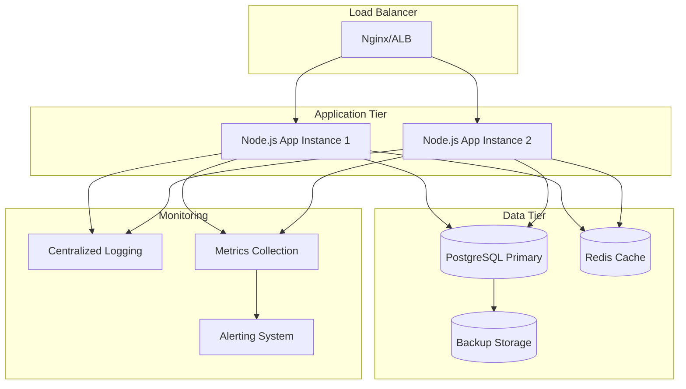

# Production Readiness Design Document

## Overview

This design transforms the existing food diary application from a development prototype into a production-ready system. The transformation focuses on replacing file-based storage with PostgreSQL, implementing proper security measures, adding comprehensive monitoring and logging, containerizing the application, and establishing CI/CD pipelines while preserving all existing functionality.

The design follows a phased approach to minimize disruption and ensure data integrity throughout the migration process.

## Architecture

### High-Level Architecture



### Database Schema Design

The PostgreSQL schema will mirror the current JSON structure but with proper normalization and relationships:

```sql
-- Users table (replaces users.json)
CREATE TABLE users (
    id UUID PRIMARY KEY DEFAULT gen_random_uuid(),
    email VARCHAR(255) UNIQUE NOT NULL,
    name VARCHAR(255) NOT NULL,
    password_hash VARCHAR(255) NOT NULL,
    created_at TIMESTAMP DEFAULT CURRENT_TIMESTAMP,
    updated_at TIMESTAMP DEFAULT CURRENT_TIMESTAMP
);

-- Foods table (replaces foods data)
CREATE TABLE foods (
    id UUID PRIMARY KEY DEFAULT gen_random_uuid(),
    user_id UUID REFERENCES users(id) ON DELETE CASCADE,
    name VARCHAR(255) NOT NULL,
    calories_per_100g DECIMAL(8,2) NOT NULL,
    protein_per_100g DECIMAL(8,2) NOT NULL,
    carbs_per_100g DECIMAL(8,2) NOT NULL,
    fat_per_100g DECIMAL(8,2) NOT NULL,
    created_at TIMESTAMP DEFAULT CURRENT_TIMESTAMP,
    updated_at TIMESTAMP DEFAULT CURRENT_TIMESTAMP
);

-- Daily meals table (replaces meal JSON files)
CREATE TABLE daily_meals (
    id UUID PRIMARY KEY DEFAULT gen_random_uuid(),
    user_id UUID REFERENCES users(id) ON DELETE CASCADE,
    date DATE NOT NULL,
    meal_type VARCHAR(50) NOT NULL, -- breakfast, lunch, dinner, etc.
    food_id UUID REFERENCES foods(id) ON DELETE CASCADE,
    amount DECIMAL(8,2) NOT NULL,
    created_at TIMESTAMP DEFAULT CURRENT_TIMESTAMP,
    UNIQUE(user_id, date, meal_type, food_id)
);

-- User settings table (replaces settings.json)
CREATE TABLE user_settings (
    id UUID PRIMARY KEY DEFAULT gen_random_uuid(),
    user_id UUID REFERENCES users(id) ON DELETE CASCADE UNIQUE,
    unit_system VARCHAR(20) DEFAULT 'metric',
    daily_calorie_goal INTEGER DEFAULT 2000,
    protein_percentage DECIMAL(5,2) DEFAULT 25.00,
    fat_percentage DECIMAL(5,2) DEFAULT 30.00,
    created_at TIMESTAMP DEFAULT CURRENT_TIMESTAMP,
    updated_at TIMESTAMP DEFAULT CURRENT_TIMESTAMP
);

-- Weight tracking table (replaces weight data)
CREATE TABLE weight_entries (
    id UUID PRIMARY KEY DEFAULT gen_random_uuid(),
    user_id UUID REFERENCES users(id) ON DELETE CASCADE,
    weight DECIMAL(5,2) NOT NULL,
    date DATE NOT NULL,
    created_at TIMESTAMP DEFAULT CURRENT_TIMESTAMP,
    UNIQUE(user_id, date)
);

-- Indexes for performance
CREATE INDEX idx_foods_user_id ON foods(user_id);
CREATE INDEX idx_daily_meals_user_date ON daily_meals(user_id, date);
CREATE INDEX idx_weight_entries_user_date ON weight_entries(user_id, date);
```

## Components and Interfaces

### Database Layer

**Database Connection Management**
- Connection pooling using `pg-pool` with configurable pool sizes
- Connection retry logic with exponential backoff
- Health checks for database connectivity
- Read/write splitting capability for future scaling

**Repository Pattern Implementation**
```javascript
// Base repository with common CRUD operations
class BaseRepository {
    constructor(tableName, pool) {
        this.tableName = tableName;
        this.pool = pool;
    }
    
    async findById(id) { /* implementation */ }
    async create(data) { /* implementation */ }
    async update(id, data) { /* implementation */ }
    async delete(id) { /* implementation */ }
}

// Specific repositories extending base
class UserRepository extends BaseRepository { /* user-specific methods */ }
class FoodRepository extends BaseRepository { /* food-specific methods */ }
class MealRepository extends BaseRepository { /* meal-specific methods */ }
```

### Configuration Management

**Environment-based Configuration**
```javascript
const config = {
    database: {
        host: process.env.DB_HOST || 'localhost',
        port: process.env.DB_PORT || 5432,
        database: process.env.DB_NAME || 'food_diary',
        username: process.env.DB_USER || 'postgres',
        password: process.env.DB_PASSWORD,
        ssl: process.env.NODE_ENV === 'production'
    },
    session: {
        secret: process.env.SESSION_SECRET,
        secure: process.env.NODE_ENV === 'production',
        maxAge: parseInt(process.env.SESSION_MAX_AGE) || 86400000
    },
    redis: {
        url: process.env.REDIS_URL || 'redis://localhost:6379'
    }
};
```

### Logging and Monitoring

**Structured Logging with Winston**
```javascript
const winston = require('winston');

const logger = winston.createLogger({
    level: process.env.LOG_LEVEL || 'info',
    format: winston.format.combine(
        winston.format.timestamp(),
        winston.format.errors({ stack: true }),
        winston.format.json()
    ),
    defaultMeta: { service: 'food-diary' },
    transports: [
        new winston.transports.File({ filename: 'logs/error.log', level: 'error' }),
        new winston.transports.File({ filename: 'logs/combined.log' }),
        new winston.transports.Console({
            format: winston.format.simple()
        })
    ]
});
```

**Request Correlation and Tracing**
- UUID-based correlation IDs for request tracing
- Request/response logging middleware
- Performance timing for database operations
- Error context preservation

### Caching Strategy

**Redis Integration**
- Session storage in Redis for horizontal scaling
- API response caching for frequently accessed data
- Cache invalidation strategies for data consistency
- Cache warming for improved performance

### Security Enhancements

**Authentication and Authorization**
```javascript
// Enhanced password policies
const passwordPolicy = {
    minLength: 8,
    requireUppercase: true,
    requireLowercase: true,
    requireNumbers: true,
    requireSpecialChars: true
};

// Rate limiting
const rateLimit = require('express-rate-limit');
const authLimiter = rateLimit({
    windowMs: 15 * 60 * 1000, // 15 minutes
    max: 5, // limit each IP to 5 requests per windowMs
    message: 'Too many authentication attempts'
});
```

**Input Validation and Sanitization**
- Joi schema validation for all API inputs
- SQL injection prevention through parameterized queries
- XSS protection with proper output encoding
- CSRF protection for state-changing operations

## Data Models

### Migration Strategy

**Phase 1: Database Setup**
1. Create PostgreSQL database and schema
2. Implement database connection and repository layers
3. Create data migration scripts from JSON to PostgreSQL

**Phase 2: Dual-Write Implementation**
1. Modify existing routes to write to both JSON files and database
2. Implement data consistency checks
3. Gradual migration of read operations to database

**Phase 3: Complete Migration**
1. Switch all read operations to database
2. Remove JSON file dependencies
3. Clean up legacy code and files

### Data Consistency and Integrity

**Transaction Management**
- Database transactions for multi-table operations
- Rollback mechanisms for failed operations
- Optimistic locking for concurrent updates

**Data Validation**
- Database-level constraints and foreign keys
- Application-level validation using Joi schemas
- Data sanitization before storage

## Error Handling

### Comprehensive Error Management

**Error Classification**
```javascript
class AppError extends Error {
    constructor(message, statusCode, isOperational = true) {
        super(message);
        this.statusCode = statusCode;
        this.isOperational = isOperational;
        this.timestamp = new Date().toISOString();
        Error.captureStackTrace(this, this.constructor);
    }
}

// Specific error types
class ValidationError extends AppError { /* validation-specific */ }
class DatabaseError extends AppError { /* database-specific */ }
class AuthenticationError extends AppError { /* auth-specific */ }
```

**Global Error Handler**
- Centralized error processing middleware
- Error logging with context preservation
- User-friendly error responses
- Error notification for critical issues

**Circuit Breaker Pattern**
- Database connection failure handling
- External service integration protection
- Graceful degradation strategies

## Testing Strategy

### Test Pyramid Implementation

**Unit Tests (70%)**
- Repository layer testing with test database
- Business logic validation
- Utility function testing
- Mock-based testing for external dependencies

**Integration Tests (20%)**
- API endpoint testing with test database
- Database operation validation
- Authentication flow testing
- Error handling verification

**End-to-End Tests (10%)**
- Critical user journey testing
- Cross-browser compatibility
- Performance regression testing
- Security vulnerability scanning

### Test Infrastructure

**Test Database Management**
- Isolated test database per test suite
- Database seeding and cleanup
- Transaction rollback for test isolation
- Test data factories for consistent test data

**Continuous Testing**
- Pre-commit hooks for unit tests
- CI pipeline integration
- Code coverage reporting
- Performance benchmarking

## Deployment and Infrastructure

### Containerization Strategy

**Docker Configuration**
```dockerfile
# Multi-stage build for optimized production image
FROM node:18-alpine AS builder
WORKDIR /app
COPY package*.json ./
RUN npm ci --only=production

FROM node:18-alpine AS production
WORKDIR /app
COPY --from=builder /app/node_modules ./node_modules
COPY . .
EXPOSE 3000
USER node
CMD ["npm", "start"]
```

**Docker Compose for Development**
- Application container
- PostgreSQL container
- Redis container
- Development volume mounts

### Infrastructure as Code

**Terraform Configuration**
- AWS/GCP/Azure resource provisioning
- Database instance configuration
- Load balancer setup
- Security group management

**Kubernetes Deployment**
- Application deployment manifests
- Service and ingress configuration
- ConfigMap and Secret management
- Horizontal Pod Autoscaling

### CI/CD Pipeline

**GitHub Actions Workflow**
```yaml
name: CI/CD Pipeline
on: [push, pull_request]
jobs:
  test:
    runs-on: ubuntu-latest
    services:
      postgres:
        image: postgres:14
        env:
          POSTGRES_PASSWORD: test
    steps:
      - uses: actions/checkout@v3
      - name: Setup Node.js
        uses: actions/setup-node@v3
      - name: Install dependencies
        run: npm ci
      - name: Run tests
        run: npm test
      - name: Run security audit
        run: npm audit
  
  deploy:
    needs: test
    runs-on: ubuntu-latest
    if: github.ref == 'refs/heads/main'
    steps:
      - name: Deploy to production
        run: # deployment commands
```

### Monitoring and Observability

**Application Performance Monitoring**
- Prometheus metrics collection
- Grafana dashboards for visualization
- Custom business metrics tracking
- SLA monitoring and alerting

**Health Checks and Readiness Probes**
```javascript
// Health check endpoint
app.get('/health', async (req, res) => {
    const health = {
        status: 'healthy',
        timestamp: new Date().toISOString(),
        checks: {
            database: await checkDatabaseHealth(),
            redis: await checkRedisHealth(),
            memory: process.memoryUsage(),
            uptime: process.uptime()
        }
    };
    
    const isHealthy = Object.values(health.checks).every(check => 
        typeof check === 'object' ? check.status === 'healthy' : true
    );
    
    res.status(isHealthy ? 200 : 503).json(health);
});
```

**Log Aggregation and Analysis**
- Centralized logging with ELK stack or similar
- Log parsing and indexing
- Alert rules for error patterns
- Performance analysis through logs

This design provides a comprehensive roadmap for transforming your food diary application into a production-ready system while maintaining all existing functionality and ensuring a smooth migration path.